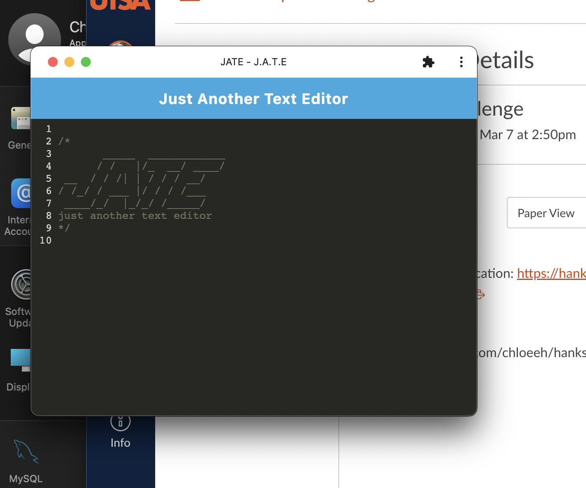

# wk19 hanks-jate

# Table of Contents
1. [Description](#description)
2. [Installation](#installation)
3. [Link to App](#usage)
4. [Credits](#credits)

## Description

The purpose of this project is to gain experience with PWAs through InjectManifest, Service Workers, Express, and handling multiple Node projects within one single-page application, so that the application can work offline. The user can install the application from the browser and use as a desktop app.

The following images show the application firstly in the browser, secondly as a desktop app: 

## Installation

This application has multiple node projects as determined by the 3 separate package.json files: _root, server, client_
The following commands allows one to properly run the application. 

From the command line, in the _root_ folder, run:

- npm install

Either cd into the _server_ folder or open it in a new terminal and run:

- npm install

Either cd into the _client_ folder or open it in a new terminal and run:

- npm install
- npm run start
- npm run build

## Usage

Here's the [link to the deployed application](https://hanks-jate.herokuapp.com/)

## Credits

Resources used:
1) Bootcamp Pre-work Modules in 19-PWA
2) Documentation linked in the homework activities
3) [Favicons Webpack Plugin](https://www.npmjs.com/package/favicons-webpack-plugin)

## License

Please refer to the LICENSE in the repository.
